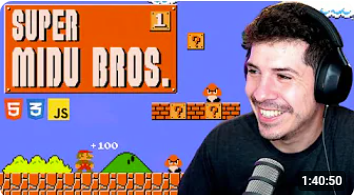
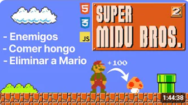

# SUPER-MARIO-PHASER-01
Basado en este video: 

[](https://www.youtube.com/watch?v=RBYCgS8Et7Y)

>[!IMPORTANT] 
> * El código original está en este repositorio: 
>[Super-Mario-Phaser
](https://github.com/decapapi/Super-Mario-Phaser/)  
>del usuario [decapapi](https://github.com/decapapi) 
>desde Enero 17 de 2024.
> * La librería base esta en este sitio: 
>[PHASER](https://phaser.io/).
> * Esta es una guía para empezar:
[Cómo crear tu primer juego con Phaser](https://phaser.io/tutorials/making-your-first-phaser-3-game-spanish#:~:text=Para%20iniciar%20un%20juego%20en,menudo%20desde%20una%20variable%20global.).
> * El repositorio del autor del video es:
> [super-midu-bros](https://github.com/midudev/super-midu-bros).

## 00. Prerrequisito​s
1. Tener el Editor [Visual Studio Code](https://code.visualstudio.com/insiders/).
2. Extensiones insaladas dentro de 
`Visual Studio Code`:  
  * [Better Comments](https://marketplace.visualstudio.com/items?itemName=aaron-bond.better-comments) 
de [Aaron Bond](https://aaronbond.co.uk/).
  * [Error Lens](https://marketplace.visualstudio.com/items?itemName=usernamehw.errorlens) 
de [Alexander](https://marketplace.visualstudio.com/publishers/usernamehw).
  * [Javascript-Essentials](https://marketplace.visualstudio.com/items?itemName=Gydunhn.javascript-essentials)
  de [Gydunhn](https://marketplace.visualstudio.com/publishers/Gydunhn),  
  Este instala un paquete con:
    * ESLint
    * npm Intellisense 
    * IntelliCode
    * JavaScript (ES6) code snippets
    * Debugger for Firefox
    * Path Intellisense
    * Formatting Toggle
  * [Live Server](https://marketplace.visualstudio.com/items?itemName=ritwickdey.LiveServer)
  de [Ritwick Dey](https://marketplace.visualstudio.com/publishers/ritwickdey).
  * [Image preview](https://marketplace.visualstudio.com/items?itemName=kisstkondoros.vscode-gutter-preview)
  de [Kiss Tamás](https://marketplace.visualstudio.com/publishers/kisstkondoros)

## 01. Crear el ambiente de trabajo

1. Creamos la carpeta "src" en la raíz del proyecto.
2. Creamos la carpeta "assets" dentro de "src".
3. Creamos la carpeta "javascript" dentro de "src".
4. Creamos el archivo **index.html** en la carpeta "src".
5. En el archivo **index.html** Escribimos el snippet :  
`htm` y seleccionamos `html:5`, el nos completa el código base de un archivo **.html**, en 12 líneas:
```html
  <!DOCTYPE html>
  <html lang="en">
  <head>
    <meta charset="UTF-8">
    <meta name="viewport" content="width=device-width, initial-scale=1.0">
    <title>Document</title>
  </head>
  <body>
    
  </body>
  </html>

```
6. Cambiamos el `<title>` por `Super Mario Phaser`.
7. Ponemos dentro del `<body>` un `<div>` con esto:  
`<div id = "game"></div>` 
7. Añadimos un `<footer></footer>` debajo del 
`</body>`.
8. Descargamos de este sitio [Phaser v3.x](https://phaser.io/download/stable), con el botón
[**phaser.min.js**].
9. El archivo descargado lo muevo a la carpeta del proyecto llamada "src/javascript".
10. Lo renombro con la versión con la que fue descargada de **phaser.min.js** a **phaser-3-8-1.min.js**.
11. En el `<footer>` del **index.html**, ponemos el
llamado al código de javascript:
```html
    <script type="module" src="./javascript/phaser-3-8-1.min.js"></script>
```
12. Creamos en la carpeta "src/javascript", un archivo llamado **game.js**.
13. A modo de pruebas solo ponemos este código
en **game.js**:  
`console.log('Probando Super-Mario');`
14. Añadimos en el `<footer>` del **index.html**
lo siguiente:
```html
    <script type="module" src="./javascript/game.js"></script>
```
15. Usando `Visual Studio Code`, nos ubicamos en el 
archivo **index.html**.
16. En la parte inferior derecha del `Visual Studio Code`, y sabiendo q instalamos la extensión:
`Live Server`, damos click en `Go Live` y el se
ejecutará en un browser 
(Vuelvo y repito estando ubicado en **index.html**).
17. Revisamos o con la tecla [`F12`] o click derecho en el browser dando en `inspect`, la `Console` y
allí nos aparece el mensaje q dejamos: 
`Probando Super-Mario` 
18. En el `<head>` de **index.html** y debajo de
`</title>`, añadimos:
```html
  <style>
    body {
      display: grid;
      place-items: center;
      height: 100vh;
      background-color: black;
    }
    #game {
      border: 1px solid white;
    }
  </style>
```

## 02. Configuración del juego
1. En el archivo **game.js**, añadimos este código:
```js
/* `Phaser` es una constante global */
const config ={
  type: Phaser.AUTO, // webgl, canvas, headless
  width: 256,
  height: 244,
  backgroundColor: 'rgba(255, 255, 255, 0)', // '#FFFFFF',
  parent: 'game',
  scene: {
    preload, // Fn se ejecuta para precargar recursos
    create, // Fn se ejecuta cuando el juego comienza
    update // Fn se ejecuta en cada frame
  }
}
```
2. Creamos las 3 funciones vacías en **game.js**:
```javascript
function preload() {}

function create() {}

function update() {}
```
3. Debo inicializar el juego, en el archivo **game.js** agrego 
este código antes del `preload` y debajo del `config`:
```js
new Phaser.Game(config);
```
* El cuadrado que representa el juego aparece en el browser
4. Quitamos del archivo **index.html**, el dato de `<style>`
relacionado con `#game`.
5. Descargamos del repositorio original la carpeta 
["assets"](https://github.com/decapapi/Super-Mario-Phaser/tree/main/assets) 
y la ponemos en la carpeta "src".
6. Ante el error de q no halla el `favicon.ico`, adicioné en el
archivo **index.html**, antes del `<title>`, la siguiente línea:  
`<link rel="shortcut icon" href="./assets/favicon.png" />`.

## 03. Primer Recurso
1. Cargamos el primer recurso, en este caso una nube 
**cloud1.png** que está en la carpeta "src/assets/scenery/overworld/" en la función `preload`:
```js
function preload() { 
  this.load.image (
    'cloud1',
    './assets/scenery/overworld/cloud1.png'
  );
}
```
2. En la función `create`, la mostramos en el juego:
```js
function create() { 
  this.add.image(0, 0, 'cloud1');
}
```
3. Cambiamos el color en **game.js**, en la zona de `config`:  
`'rgba(255, 255, 255, 0)'` -> `'#009dd8'`.
4. Como la nube sale en posición y tamaño incorrecto, cambiamos
la nube por : `this.add.image(0, 0, 'cloud1').setScale(0.15);`.
5. Sigue apareciendo media nube, porque las posiciones son la
mitad de la imagen, para q tome el origen de la imagen añadimos 
`setOrigin`:
```js
  this.add.image(0, 0, 'cloud1')
    .setOrigin(0, 0)
    .setScale(0.15);
```

>[!IMPORTANT]  
> Antes de subir el repositorio, borré la carpeta 
>"src/assets/showcase".
>
> Los archivos son muestras del 
>producto terminado, para ser vistos en el repositorio, pero no 
>hacen parte del código necesario para el juego.

## 04. El recurso de Mario y el Suelo
1. Añadimos en **games.js** este código en `preload`, para que
cargue el sprite de Mario:
```js
  this.load.spritesheet(
    'mario',
    './assets/entities/mario.png',
    { frameWidth: 18, frameHeight: 16 }
  );
```
2. En `create` de **games.js**, ponemos este código y Mario 
aparecerá en pantalla:
```js
  this.add.sprite(50, 200, 'mario')
    .setOrigin(0, 0);
```
3. En la función `preload` de **games.js**, añadimos este código,
para cargar el Suelo:
```js
  this.load.image(
    'floorbricks',
    './assets/scenery/overworld/floorbricks.png'
  );
```
4. Añadimos a `create` de **games.js**, este código y el Suelo
aparecerá en el juego:
```js
  this.add.tileSprite(0, config.height - 32, config.width, 32,
    'floorbricks')
    .setOrigin(0, 0);
```
5. Movemos la nube a una posición no tan en la esquina con esto:  
`this.add.image(100, 50, 'cloud1')`

## 05. Mover el Personaje
1. Añadimos el método para reconocer las teclas llamado:
`createCursorKeys()` , en la función `create` de **game.js**:
```js
  this.keys = this.input.keyboard.createCursorKeys();
```
2. Cuando creamos el sprite con el id de `'mario'`, faltó 
asociarlo a un objeto, en la función `create` de **game.js**,
así se haría la corrección:
```js
  this.mario = this.add.sprite(50, 200, 'mario')
    .setOrigin(0, 0);
```
3. En la función `update` de **game.js**, ponemos una 
condición relacionada con la tecla [`Flecha-izquierda`] ⬅️.
```js
  if (this.keys.left.isDown) {
    // Movemos a mario en el Eje `x` a menos 2 ⬅️ 
    this.mario.x -= 2;
  }
```
4. En la misma `update`, añadimos el `else if` para mover
el personaje con la tecla [`Flecha-derecha`] ➡️
```js
   else if (this.keys.right.isDown) {
    // Movemos a mario en el Eje `x` mas 2  ➡️
    this.mario.x += 2;
  }
```
>[!TIP]  
> Logramos "Moverlo" entre derecha e izquierda, pero la imagen
>le falta animación, eso lo veremos mas adelante.

## 06. Las Animaciones
1. En la función `create` de **game.js**, usando la propiedad
`anims`, creamos las animaciones usando una clave `key`:
```js
  this.anims.create({
    key: 'mario-walk',    //  ---------> Nombre único o ID
    frames: this.anims.generateFrameNumbers(
      'mario',  //  -------------------> ID del `spritesheet`
      { start: 1, end: 3 }  //  -------> Frames desde y hasta  
    ),
    frameRate: 6, //  -----------------> Reduce la velocidad
    repeat: -1  //  -------------------> Repite infinito
  });
```
2. En el `update` de **game.js**, al momento de decrementar
la posición `x` del objeto `this.mario`, también aplicamos
la animación, es decir a la izquierda:
```js
    this.mario.anims.play('mario-walk', true);
```
3. Lo mismo para el momento de mover a la derecha.

>[!CAUTION]  
> Ahí el detalle es que una vez empieza a moverse, queda en un
>movimiento perpetuo, de alguna manera el debe detenerse si no 
>estoy presionando ninguna de las teclas que provoca el 
>desplazamiento.

4. En la función `create` de **game.js**, ponemos el mario que
no está haciendo nada:
```js
  this.anims.create({
    key: 'mario-idle',
    frames:[{ key: 'mario', frame: 0}]
  });
```
5. En el `update` de **game.js**, añadimos un `else`, en caso
que no se use ni la tecla derecha o izquierda:
```js
    else {
    this.mario.anims.play('mario-idle', true);
  }
```
6. Cuando el Personaje va a la izquierda, este va de espaldas,
toca es girarlo para que se mueva en otro sentido, con
`filpX`:  
`this.mario.flipX = true;`
7. Y si va a la derecha, se le dice q deje de girar:  
`this.mario.flipX = false;`

## 07. Animación de Saltar
1. En la función `create` de **game.js**, ponemos el mario que
no está haciendo nada:
```js
  this.anims.create({
    key: 'mario-jump',
    frames:[{ key: 'mario', frame: 5}]
  });
```
2. En el `update` de **game.js**, añadimos aparte una condición
conla tecla [`Flecha-arriba`] ⬆️
```js
  if (this.keys.up.isDown){
    // Movemos a mario en el Eje `x` a menos 5  ⬆️
    this.mario.y -= 5;
    this.mario.anims.play('mario-jump', true);
  }
```

>[!WARNING]  
>Como no hay gravedad el seguirá subiendo sin caer.

## 08. Físicas
1. En el `config` de **game.js**, añadimos un elemento de 
`physics`:
```js
const config = {
  ...,
  physics: {
    default: 'arcade',  // box2d, chipmunk, ninja, p2
    arcade: {
      gravity: { y: 300 },
      debug: false
    }
  },
  ...
}
```
2. En el `create` de **game.js**, comentamos la forma de
mostar a `mario` y le añadimos esta, cambiando también
la posición inicial del `mario`:
```js
  this.mario = this.physics.add
    .sprite(50, config.height - 16 * 4, 'mario')
    .setOrigin(0, 0);
```
>[!TIP]  
> Mario se cae, si, pero detrás de los ladrillos del piso.
> Para solucionar, cambiamos el orden en `create`:
> 1. `this.add.image(..., 'cloud1') ...`
> 2. `this.add.tileSprite(..., 'floorbricks') ...`
> 3. `this.mario = this.physics.add.sprite(..., 'mario') ...`

3. Creamos un objeto llamado `floor` con el método 
`staticGroup()` en `create`:
```js
  this.floor = this.physics.add.staticGroup();
```
4. El objeto `floor` lo utilizamos para crear uno o dos pisos:
```js
  this.floor
    .create(0, config.height - 32, 'floorbricks')
    .setOrigin(0,0);
```
5. Comentamos el otro `'floorbricks'` de `create`.
6. Añadimos otro piso en una posición mas adelante:
```js
  this.floor
    .create(160, config.height - 32, 'floorbricks')
    .setOrigin(0, 0);
```
7. El mario se sigue cayendo, se debe crear una colisión
que es el método `collider` en la función `create`, lo
hacemos antes de la definición de `keys`:
```js
  this.physics.add.collider(this.mario, this.floor);
```
8. El `mario` aparece flotando y si se mueve se cae
directamente, entonces se añade a los dos `floor` en
la función `create`, el método `refreshBody()`.

## 09. Evitar que mario se salga del universo
1. Añadir en `create` para el objeto `mario`, este método:
`setCollideWorldBounds(true)`.
>[!TIP]  
>Lo gracioso es q cuando llegue a la separación de los pisos
>tampoco se caerá 😅  
>Mas adelante se solucionará este tema.

## 10. Salto mas natural
1. Añadimos a la condición de la función `update` para la tecla
 [`Flecha-arriba`] ⬆️ que `mario` esté tocando el piso:
`if (this.keys.up.isDown && this.mario.body.touching.down) {`
2. Cambiamos el hecho de ponerle una posición en el eje `y`, 
para establecer una velocidad negativa:
`this.mario.setVelocityY(-300);`
3. En el `create` al objeto `mario` le añadimos `setGravityY`.

## 11. La Cámara
1. Añadimos los límites en el _Mundo_, en el archivo
**game.js** , para la función `create`, añadimos esto:
```js
  this.physics.world.setBounds(0, 0, config.width * 2, config.height);
```
2. Ponemos los límites de la _Cámara_, añadiendo esto en la
función `create`:
```js
  this.cameras.main.setBounds(0, 0, config.width * 2, config.height);
```
3. Le decimos a la _Cámara_ a quien tiene que seguir, con este
código en **game.js**, para la función `create`:
```js
  this.cameras.main.startFollow(this.mario);
```
4. Como el mundo ya se expandió, aprovechamos para poner mas
suelo de ladrillos, a la derecha en la función `create`:
```js
  this.floor
    .create(320, config.height - 32, 'floorbricks')
    .setOrigin(0, 0)
    .refreshBody();

  this.floor
    .create(480, config.height - 32, 'floorbricks')
    .setOrigin(0, 0)
    .refreshBody();
```

## 12. Separar las Animaciones
1. Crear el archivo **animations.js** en la carpeta
 "src/javascript", en este código base:
```js
export const createAnimations = (game) => {

}
```
2. En el archivo **game.js**, importamos el `createAnimations`:
```js
import { createAnimations } from "./animations.js";
```
3. En la función `create` de **game.js**, añadimos el nuevo
`createAnimations` enviando el `this`, justo debajo de la
asignación del objeto `keys`.
4. Cortamos todo lo q se relaciona con `anims` y lo llevamos
a el nuevo archivo **animations.js**.
5. En el archivo **animations.js**, cambiamos el término 
`this` por `game`:
```js
export const createAnimations = (game) => {
  game.anims.create({
    key: 'mario-walk',    //  ---------> Nombre único o ID
    frames: game.anims.generateFrameNumbers(
      'mario',  //  -------------------> ID del `spritesheet`
      { start: 1, end: 3 }  //  -------> Frames desde y hasta  
    ),
    frameRate: 6, //  -----------------> Reduce la velocidad
    repeat: -1  //  -------------------> Repite infinito
  });
  game.anims.create({
    key: 'mario-idle',
    frames: [{ key: 'mario', frame: 0 }]
  });
  game.anims.create({
    key: 'mario-jump',
    frames: [{ key: 'mario', frame: 5 }]
  });
}
```
6. En el archivo **animations.js** agregamos una nueva para
la muerte de `mario`, llamada `mario-dead`:
```js
  game.anims.create({
    key: 'mario-dead',
    frames: [{ key: 'mario', frame: 4 }]
  });
```
7. En el archivo **game.js**, para función `update` al final
añadimos esto:
```js
  if (this.mario.y >= config.height - 12) {
    //  La muerte de `mario`
    this.mario.anims.play('mario-dead', false);
  }
```
>[!WARNING]  
>El `mario` no muestra la animación de la muerte, cuando está
>cayendo, esto es debido que el mario está creado como 
>punto de partida la esquina superior izquierda, para el
>juego, debemos tomar la esquina inferior izquierda, para hacer
>esto, en la creación del objeto `mario`, cambiamos el 
>`setOrigin` a esto:  
>`.setOrigin(0, 1)`

8. Adicionamos una propiedad `isDead`, al objeto `mario`, 
y lo llenamos con el valor de `true`:
```js
  this.mario.isDead = true;
```
9. También desactivamos el límite del mundo, para que termine
de caer:
```js
  this.mario.setCollideWorldBounds(false);
```
10. Como el `mario` se puede mover estando muerto, justo al
inicio de la función `update`, ponemos un `return`. 
```js
if (this.mario.isDead) return;
```
11. El `mario` cuando se muere, hace un salto pequeño, esto lo 
podemos programar en un intervalo de tiempo, dentro de la
misma condición de que `mario` está en caída:
```js
    setTimeout(() => {
      this.mario.setVelocityY(-250);
    }, 100);
```

## 13. Agregamos un Audio
1. Vamos a agregar al menos el audio de la muerte de `mario`,
en el archivo **game.js** en la función `preload` añadimos 
esto:
```js
  this.load.audio(
    'gameover',
    './assets/sound/music/gameover.mp3'
  );
```
2. Justo depués de `this.mario.setCollideWorldBounds(false);`
ponemos el sonido del `'gameover'` en la función `update`, 
de una vez con el control de volúmen:
```js
    this.sound.add(
      'gameover',
      { volume: 0.2 })
      .play();
```
3. Justo depués reiniciamos el juego, luego de un intervalo
de 7 segundos, lo que dura el sonido anterior, en **game.js** al final de la condición de la muerte de `mario`:
```js
    setTimeout(() => {
      this.scene.restart();
    }, 7000);
```
>[!TIP]  
>En el Browser de Chrome, suena la música del `gameover` sin
>problemas, pero en Firefox, esta en silencio, hice varias
>consultas, pero me funcionó el hecho de dar click derecho
>al tab de Firefox, y seleccionar `mute`, para luego dar 
>al tab de Firefox, y seleccionar `unmute`.  
>
> Aunque algunas veces en Firefox no funciona ☹️.

# SUPER-MARIO-PHASER-02
Basado en este video: 

[](https://www.youtube.com/watch?v=kPgDqdCdjfE)

## 14. Correcciones de sonido y salto
1. Algo podremos intentar solucionar con el audio, poniéndolo
en un `try/catch`, en el método `update` de **game.js**:
```js
    try {
      this.sound.add(
        'gameover', { volume: 0.2 }).play();
    } catch (error) {
      console.log(error);
    }
```
2. Cambiamoe en la configuración de **game.js**, para que
el auto foco sea falso: `autoFocus: false,`
3. Mejoramos el salto en **game.js** para el método `update`:
```js
    else if (this.mario.body.touching.down) {
    this.mario.anims.play('mario-idle', true);
  }
```
4. Podemos simplificar a `keys`, `mario`, `sound` y `scene`
 del `this`, en el código del `update` en **game.js**, 
 usando esto:  
`const { keys, mario, sound } = this;`  
Por ejemplo:
```js
function update() {
  const { keys, mario } = this;

  if (mario.isDead) return;

  if (keys.left.isDown) {
    ...
  } else if (keys.right.isDown) {
    ...
  } else if (mario.body.touching.down) {
    ...
  }

  if (keys.up.isDown && mario.body.touching.down) {
    ...
  }

  if (mario.y >= config.height - 12) {
    ...
  }
}
```
5. Creamos una constante en `update` de **game.js**, para
saber si mario esta tocando el piso:  
`const isMarioTouchingFloor = mario.body.touching.down;`  
y reemplazamos donde aparece: `mario.body.touching.down`
6. Aplicamos constantes para las teclas en `update` de
**game.js**:
```js
  const isLeftKeyDown = keys.left.isDown;
  const isRightKeyDown = keys.right.isDown;
  const isUpKeyDown = keys.up.isDown;
```
7. Al momento de que se llame la animación `mario-walk`, tanto
a la izquierd como a la derecha, le ponemos un condicional con
`&&`, ejemplo:  
`isMarioTouchingFloor && mario.anims.play('mario-walk', true);`

## 15. Añadimos el LINT
>[!TIP]
> 1. Instalar `nvm` descargando el instalador desde este sitio:
>[nvm-setup.exe](https://github.com/coreybutler/nvm-windows/releases/download/1.1.12/nvm-setup.exe).
> 2. Instalar el `node`, que a su vez
>trae el `npm` basado en este sitio: 
>[Instalar múltiples versiones de Node.js en Windows](https://rafaelneto.dev/blog/instalar-multiples-versiones-nodejs-windows/).  
>Con el `nvm` permite múltiples versiones
>del `node`.
> 3. El programa `pnpm` es similar al `npm`, siendo un mejor empaquetador.  
>Este lo puede conseguir con las instrucciones de este sitio
>[pnpm Installation](https://pnpm.io/installation).  
>4. Instalamos las extensiones en `Visual Studio Code`:
> * [ESLint](https://marketplace.visualstudio.com/items?itemName=dbaeumer.vscode-eslint) 
>de [Microsoft](https://www.microsoft.com/es-co/).
> * [Prettier - Code formatter](https://marketplace.visualstudio.com/items?itemName=esbenp.prettier-vscode)
>de [Prettier](https://prettier.io/)

1. En una `TERMINAL` del `Visual Studio Code`, ponemos este comando:
```gitbash
pnpm install standard -D
```
ó
```gitbash
npm i standard -D
```
>[!NOTE]  
>De preferencia el primero(`pnpm`) pero en caso que falle, 
>seguir usando el segundo(`npm`).

>[!TIP]  
>Este proceso crea la carpeta "node_modules" y dos archivos:
> * **package.json**
> * **package-lock.json** ó **pnpm-lock.yaml**
>
> El archivo **package.json** debe tener un
> contenido similar a este:
>```json
>{
>  "devDependencies": {
>    "standard": "^17.1.0"
>  }
>}
>```

2. Añadimos al **package.json**, el contenido de:  
`"eslintConfig": { "extends" : "standard" },`, a partir de 
la línea 2, quedando el **package.json** así:
```json
{
  "eslintConfig": {
    "extends" : "standard"
  },
  "devDependencies": {
    "standard": "^17.1.0"
  }
}
```
3. Creo el archivo **.eslintrc.json** 
(OJO: El archivo empieza con el punto) y ponemos este texto:
```json
{
    "parserOptions": {
      "ecmaVersion": 2020
    },
    "rules": {
      "no-unused-vars": "error",
      "no-undef": "error"
    }
  }
```

## 15. Refactorizando
1. Creamos en la carpeta "src\javascript" el 
archivo **controles.js**.
2. Empezamos con este código:
```js
export function checkControls({mario, keys}){

}
```
>[!CAUTION]  
>Nos aparece un error en pantalla relacionado 
>con el `module`, la solución por ahora fue 
>borrar el archivo **.eslintrc.json**.  
>
>Esto solicita hacer cambios como quitar los
>punto-y-coma `;` y cambiar las comillas
>dobles `"` por las sencillas `'`.

>[!WARNING]  
>En el archivo **game.js**, tengo dos errores
>de `lint`, en estos sitios:
> * ` type: Phaser.AUTO, `
> * `new Phaser.Game(config)`

3. Cambiar en **game.js** el contexto inicial de 
`const { keys, mario, sound, scene } = this;`
a `const { mario, sound, scene } = this;`

4. Ponemos esto en el archivo **controles.js**:
```js
export function checkControls({mario, keys}){

  const isLeftKeyDown = keys.left.isDown;
  const isRightKeyDown = keys.right.isDown;
  const isUpKeyDown = keys.up.isDown;

  const isMarioTouchingFloor = mario.body.touching.down;
  
  if (isLeftKeyDown) {
    // Movemos a mario en el Eje `x` a menos 2 ⬅️ 
    mario.x -= 2;
    isMarioTouchingFloor && mario.anims.play('mario-walk', true);
    mario.flipX = true;
  } else if (isRightKeyDown) {
    // Movemos a mario en el Eje `x` mas 2  ➡️
    mario.x += 2;
    isMarioTouchingFloor && mario.anims.play('mario-walk', true);
    mario.flipX = false;
  } else if (isMarioTouchingFloor) {
    mario.anims.play('mario-idle', true);
  }

  if (isUpKeyDown && isMarioTouchingFloor) {
    // Movemos a mario en el Eje `y` a -300 de velocidad  ⬆️
    mario.setVelocityY(-300);
    mario.anims.play('mario-jump', true);
  }
}
```
5. Verificamos que lo de **controles.js** no
esté en **game.js** (se MUEVE, no simple copia).
6. Importamos la función exportada de `controles`
en el archivo **game.js**:  
`import { checkControls } from './controles.js';`
7. En la función `update` , hacemos el llamado:  
`checkControls(this);`

## 16. Agregando el primer enemigo
1. Cargando a `goomba` como un `spreedsheet`
en el archivo **game.js** para la función
`preload`:
```js
  this.load.spritesheet(
    'goomba',
    './assets/entities/overworld/goomba.png',
    { frameWidth: 16, frameHeight: 16}
  )
```
2. En la función `create` para **game.js**, 
después de que aparezca mario, ponemos a `goomba`
```js
  this.goomba = this.physics.add
    .sprite(120, config.height - 16 * 2, 'goomba')
    .setOrigin(0, 1)
    .setGravityY(500)
    .setVelocityX(-50)
```
3. Ponemos la colisión de `goomba` contra el 
`floor`:
```js
  this.physics.add.collider(this.goomba, this.floor)
```
4. Para el momento de la colisión entre `mario`
y `goomba`, hacemos un callback:
```js
  this.physics.add.collider(this.mario, this.goomba,
    onHitEnemy
  )
```
5. Debajo del `create`, ponemos una función
llamada `onHitEnemy`:
```js
function onHitEnemy(mario, goomba) {
  if (mario.body.touching.down && goomba.body.touching.up) {
    goomba.destroy();
    mario.setVelocityY(-200).setVelocityX(0);
  } else {
    // mario muere
  }
}
```
6. Añadimos animación para `goomba` en el 
archivo **animations.js**:
```js
  game.anims.create({
    key: 'goomba-walk',
    frames: game.anims.generateFrameNumbers(
      'goomba',
      { start: 0, end: 1 }
    ),
    frameRate: 12,
    repeat: -1
  })
```
7. Justo depués de `createAnimations(this)`
colocamos el `play` de `goomba`:
```js
  this.goomba.anims.play('goomba-walk', true)
```
8. Añadimos las animación cuando el `goomba`
muere:
```js
  game.anims.create({
    key: 'goomba-hurt',
    frames:[{ key: 'goomba', frame: 2 }]
  })
```
9. En la función `onHitEnemy`, cambio varias cosas:  
```js
function onHitEnemy (mario, goomba) {
  if (mario.body.touching.down && goomba.body.touching.up) {
    goomba.anims.play('goomba-hurt', true)
    goomba.setVelocityX(0)
    mario.setVelocityY(-200).setVelocityX(0)
    // Espero un tiempo para destruirlo
    setTimeout(() => {
      goomba.destroy()
    }, 500)
  } else {
    // mario muere
  }
}
```
10. Cargo el sonido de `goomba-stomp` en
el `preload` de **game.js**:
```js
  this.load.audio('goomba-stomp', './assets/sound/effects/goomba-stomp.wav')
```
11. La colisión de `mario` con `goomba`
le paso mas parámtros :  
`this.physics.add.collider(this.mario, this.goomba, onHitEnemy, null, this)`
12. En la función `onHitEnemy`, añado el 
sonido del aplastamiento de `goomba`:
```js
  this.sound.play('goomba-stomp')
```

## 17. Refactorizamos Sonidos
1. Creamos archivo **audio.js** en la carpeta
"src/javascript"
2. Creamos dos funciones que se exportan:
```js
export const initAudio = ({ load }) => { }

export const playAudio = () => { }
```
3. Movemos de `create` de **game.js**, las 2 líneas
de audio.
4. Cambiamos en **audio.js** el `this.load`, por
solo `load`
5. Importamos las dos funciones en **game.js**:
```js
  import { initAudio, playAudio} from './audio.js'
```
6. Usamos el `initAudio` en la función `preload`
de **game.js**:  
`initAudio(this)`
7. Cargamos la lista de audios en una constante
json y simplificamos en **audio.js** su uso:
```js
const INIT_AUDIOS = [
  {
    key: 'gameover',
    path: './assets/sound/music/gameover.mp3'
  },
  {
    key: 'goomba-stomp',
    path: './assets/sound/effects/goomba-stomp.wav'
  }
]
export const initAudio = ({ load }) => {
  INIT_AUDIOS.forEach(({ key, path }) => {
    load.audio(key, path)
  })
}
```
8. El proceso para darle `play` en **audio.js**
```js
export const playAudio = (id, { sound }, { volume = 1 } = {}) => {
  try {
    return sound.add(id, { volume }).play()
  } catch (error) {
    console.error(error)
  }
}
```
9. En el archivo **game.js** , para la función
`onHitEnemy` en vez de :  
`this.sound.play('goomba-stomp')`, ponemos
`playAudio('goomba-stomp', this)`
10. En el archivo **game.js** , para la función
`update`, cambiamos :  
`sound.add('gameover', { volume: 0.2 }).play()`
por `playAudio('gameover', this, { volume: 0.2 })`
11. Quitamos el `try/catch` en la función `update`
para el sonido de `gameover` en **game.js**.
12. Quitamos en la función `update` de **game.js**
 el `sound` del contexto, para quedar así:
```js
  const { mario, scene } = this
```
<!--
>[!TIP]  
>El tema del LINT o ESLINT, me ha estado rondando, hallé un
>mejor formato para el archivo **.eslintrc.json**, y un video 
>con un ejemplo mas acorde lo requrido:  
>[](https://www.youtube.com/watch?v=bClwMhv50aI).  
> 1. Tener el nodejs instalado (Visto en [15. Añadimos el LINT](#15-añadimos-el-lint) ).
> 2. Desinstalar el `standard`:  
> `npm uninstall standard -D` ó `pnpm uninstall standard -D`.
> 3. Borrar la carpeta "node_modules".
> 4. Borrar estos 2 archivos:
> * **package-lock.json** y/o **pnpm-lock.yaml**
> * **package.json**
> 5. Instalar (ojalá con `pnpm`), estos 2 en modo `dev`:
>```bash
>pnpm i eslint-config-airbnb-base -D 
>pnpm i eslint-plugin-import -D
>```
> * Si le falla `pnpm` , hace lo mismo con `npm`.
> 6. Así debe quedar el **package.json**:
>```json
>	{
>	  "devDependencies": {
>	    "eslint-config-airbnb-base": "^15.0.0",
>	    "eslint-plugin-import": "^2.29.1"
>		}
>	},
>```
> 7. Creamos de nuevo el archivo **.eslintrc.json**, con esto:
>```json
>	{
>	  "env": {
>	    "browser": true,
>	    "es2020": true
>	  },
>	"config": {}  "extends": [
>	    "airbnb-base"
>	  ],
>	  "parserOptions": {
>	"ecmaVersion": 11
>	  },
>	"rules": {
>	    "linebreak-style": "off",
>	    "eslint-plugin-import/extensions": true,
>	    "switch-colon-spacing": "error",
>	    "no-restricted-imports": "warn"
>	  }
>	}
>```
> 8. Presiono en `Visual Studio Code` las teclas: 
> [`Ctrl`] + [`Shift`] + [`P`]  
> y selecciono o busco `Restart ESLint Server`
-->

## 18. Hacer que el `goomba` mate al `mario`
1. Creamos en **game.js** debajo de `update` la función:
`killMario`, y movemos todo lo del `update` relacionado con
la muerte:
```js
function killMario(game){
    //  La muerte de `mario`
    game.mario.isDead = true;
    game.mario.anims.play('mario-dead', false);
    game.mario.setCollideWorldBounds(false);
    playAudio('gameover', game, { volume: 0.2 });

    setTimeout(() => {
      game.mario.setVelocityY(-250);
    }, 100);

    setTimeout(() => {
      game.scene.restart();
    }, 7000);
}
```
2. Este sería todo el `update`:
```js
function update() {
  if (this.mario.isDead) return;
  checkControls(this);

  if (this.mario.y >= config.height - 12) {
    killMario(this);
  }
}
```
3. Podemos sacar el `mario` y la `scene` del `game` en la 
función `killMario` de **game.js**:
```js
  const {mario, scene} = game;
```
4. De ahi para abajo , borramos todo lo que diga `game.` 
(OJO: con el gunto al final).
5. De nuevo en la función `killMario`, ponemos un `return` si
`mario` está muerto:  
`if (mario.isDead) return;`
6. En la función `onHitEnemy`, para el `else`, llamamos
el `killMario`.
7. Evitamos que `mario` detecte las colisiones en la función
 `killMario` debajo del `playAudio('gameover'...)`:
```js
	mario.body.checkCollision.none = true;
```
8. En el `killMario` a `mario` le ponemos la velocidad `X` en
cero.
```js
	mario.setVelocityX(0);
```

## 19. Agregando Monedas

1. Creamos el archivo **spritesheet.js** en la carpeta
"src/javascript".
2. Empezamos con un `export`:
```js
export const initSpritesheet = ({ }) => {

}
```
3. Movemos de **game.js**, lo de la función `preload`, lo
relacionado con `spritesheet` y tomando el `load` como
parámetro a extraer:
```js
export const initSpritesheet = ({ load }) => {
  load.spritesheet('mario', './assets/entities/mario.png', {
    frameWidth: 18,
    frameHeight: 16
  });

  load.spritesheet('goomba', './assets/entities/overworld/goomba.png', {
    frameWidth: 16,
    frameHeight: 16
  });
}
```
4. Importamos en **game.js**, lo de `initSpritesheet`:  
`import { initSpritesheet } from './spritesheet.js';`
5. Y en el `preload` llamamos dicha función:  
`initSpritesheet(this);`
6. En el archivo **spritesheet.js**, hacemos una `const`
llamada `INIT_SPRITSHEETS`, con este valor:
```js
const INIT_SPRITSHEETS = [
  {
    key: 'mario',
    path: './assets/entities/mario.png',
    frameWidth: 18,
    frameHeight: 16
  },
  {
    key: 'goomba',
    path: './assets/entities/overworld/goomba.png',
    frameWidth: 16,
    frameHeight: 16
  }
]
```
7. La parte de inicializar se la dejamos a un `forEach`:
```js
export const initSpritesheet = ({ load }) => {
  INIT_SPRITSHEETS.forEach(
    ({ key, path, frameWidth, frameHeight }) => {
      load.spritesheet(key, path, { frameWidth, frameHeight });
    });
}
```
8. A la `const` llamada `INIT_SPRITSHEETS` de 
**spritesheeet.js**, añadimos otro q seran las `coin`:
```js
  {
    key: 'coin',
    path: './assets/collectibles/coin.png',
    frameWidth: 16,
    frameHeight: 16
  }
```
9. Creamos la animación en el archivo **animations.js**:
```js
  game.anims.create({
    key: 'coin-idle',
    frames: game.anims.generateFrameNumbers(
      'coin',
      { start: 0, end: 3 }
    ),
    frameRate: 12,
    repeat: -1
  });
```
10. Para que parezcan las moneda en el `create` de **game.js**
Creamos un `staticGroup`, debajo de la creacion de 
`this.goomba`:
```js
  this.coins.create(150, 150, 'coins')
    .anims.play('coin-idle', true);
```
11. Subimos al principio de la función `create` el llamado
de `createAnimations(this);`
12. Ponemos otras dos monedas:
```js
  this.coins.create(300, 150, 'coins')
    .anims.play('coin-idle', true);
  this.coins.create(450, 150, 'coins')
    .anims.play('coin-idle', true);
```
13. Hacemos un tipo de colisión que es algo diferente llamada
`overlap`:
```js
  this.physics.add.overlap(this.mario, this.coins,
    collectCoins, null, this);
```
14. Creamos la función `collectCoins`, con esto:
```js
function collectCoins(mario, coin) {
  coin.destroy();
}
```
15. En el archio **audio.js**, añadimos otro elemento a la
`INIT_AUDIOS`:
```js
  {
    key: 'coin-pickup',
    path: './assets/sound/effects/coin.mp3'
  }
```
16. Así queda por ahora el `collectCoins`:
```js
function collectCoins(mario, coin) {
  coin.destroy(); //coin.disableBody(true, true);
  playAudio('coin-pickup', this, { volume: 0.1 });
}
```

>[!TIP]  
> ### Mejora del ESLINT o LINT
> 1. Tener el nodejs instalado (Visto en [15. Añadimos el LINT](#15-añadimos-el-lint) ).
> 2. Tener instalado como vimos en ese mismo paso el paquete
> de `standard`:  
>`pnpm install standard -D` ó `npm i standard -D`
> 3. Corregir el **package.json**, para que solo tenga esto:
>```json
> {
>   "devDependencies": {
>     "standard": "^17.1.0"
>   }
> }
>```
> 4. Este sería el archivo **.eslintrc.json**:
>```json
> {
> "extends": ["standard"],
>   "rules": {
>     "semi" : [2, "always"],
>     "comma-dangle": [2, "always-multiline"] 
>   }
> }
>```
> 5. La extensión de `Prettier` (Visto en [15. Añadimos el LINT](#15-añadimos-el-lint) ), requiere ajustes, estos 
>se pueden hacer en el archivo de configuracion del usuario:  
>Presiono en `Visual Studio Code` las teclas: 
> [`Ctrl`] + [`Shift`] + [`P`]  
> y selecciono o busco `Open User Settings (JSON)`
>```json
>	"prettier.jsxSingleQuote": true,
>	"prettier.singleQuote": true,
>	"prettier.eslintIntegration": true,
>	"prettier.spaceParenthesis": true,
>	"[javascript]": {
>		"editor.defaultFormatter": "esbenp.prettier-vscode"
>	},
>	"[json]": {
>		"editor.defaultFormatter": "esbenp.prettier-vscode"
>	},
>```
> 6. Presiono en `Visual Studio Code` las teclas: 
> [`Ctrl`] + [`Shift`] + [`P`]  
> y selecciono o busco `Restart ESLint Server`
> 7. El Formato en `Visual Studio Code` se invoca con las teclas :  
>[`Alt`] + [`Shift`] + [`F`] 
> * Este proceso aplicó un nuevo formato a todos los archivos
> ***.js**

## 20.Agregar puntuación al coleccionar monedas
1. Utilizamos los fonts que están en la carpeta 
"src/assets/fonts", Añadimos esto al **index.html**, justo
debajo de `<style>`:
```html
    @font-face {
      font-family: "pixel";
      src: url("/src/assets/fonts/SuperMario.ttf");
    }
```
2. En el archivo **index.html**, dentro de `<style>` en
la deficnición del `body {`, agregamos:
```html
      font-family: "pixel", sans-serif;
```
3. En el archivo **game.js**, en la función 
`collectCoins`, añadimos un texto en pantalla:
```js
  this.add.text(coin.x, coin.y, 100, {
    fontFamily: 'pixel',
    fontSize: config.width / 40,
  });
```
4. Hacemos animación para enviar hacia arriba el número:
```js
  this.tweens.add({
    targets: scoreText,
    duration: 500,
    y: scoreText.y - 100,
  });
```
5. Añadimos un callback a esta animación de `tweens`, 
quedanto toda la animación así:
```js
  this.tweens.add({
    targets: scoreText,
    duration: 500,
    y: scoreText.y - 100,
    onComplete: () => {
      // Añadimos otra animación para cambiar la opacidad
      this.tweens.add({
        targets: scoreText,
        duration: 100,
        alpha: 0,
        // Destruimos por completo el texto
        onComplete: () => {
          scoreText.destroy();
        },
      });
    },
  });
```
6. Agregamos la función `addToScore` en **game.js**, justo
encima de `onHitEnemy`:
```js
function addToScore (scoreToAdd, origin, game) {

}
```
7. Movemos todo lo nuevo desde `// Pone el Puntaje` a la funciónnueva función `addToScore`:
```js
function addToScore (scoreToAdd, origin, game) {
  // Pone el Puntaje ganado al recuperar la moneda
  const scoreText = game.add.text(
    origin.x, origin.y, scoreToAdd, {
      fontFamily: 'pixel',
      fontSize: config.width / 40,
    });
  // Animación para enviar hacia arriba el número
  game.tweens.add({
    targets: scoreText,
    duration: 500,
    y: scoreText.y - 100,
    onComplete: () => {
      // Añadimos otra animación para cambiar la opacidad
      game.tweens.add({
        targets: scoreText,
        duration: 100,
        alpha: 0,
        // Destruimos por completo el texto
        onComplete: () => {
          scoreText.destroy();
        },
      });
    },
  });
}
```
8. Llamamos la nueva función `addToScore`, al final de 
`collectCoins`:
```js
  addToScore(100, coin, this);
```
9. En la función `onHitEnemy` de **game.js**, añadimos esto
despues de `playAudio('goomba-stomp', this);`:
```js
addToScore(200, goomba, this);
```

## 21. Hacer al `mario` grande
1. En **game.js**, cambiamos `coins` a `collectibles` en
la función `create`.
2. Cambiamos el nombre de la función `collectCoins` por
`collectItems`.
3. Cambiamos la función `collectItems` de esta manera:
```js
function collectItems (mario, item) {
  if (item.texture.key === 'coin') {
    item.destroy(); // item.disableBody(true, true);
    playAudio('coin-pickup', this, { volume: 0.1 });

    addToScore(100, item, this);
  } else {
    console.log(item.texture.key);
  }
}
```
4. En la función `preload` de **game.js**, añadimos el
`supermushroom`:
```js
  this.load.image('supermushroom', './assets/collectibles/super-mushroom.png');
```
5. En la función `create` de **game.js**, añadimos el
`supermushroom` como un `collectibles`:
```js
  this.collectibles.create(350, config.height - 16 * 4, 'supermushroom');
```
6. La colisión de los `item` ya está detectada con el 
`overlap`, y en la función `collectItems`, hacemos estos
cambios:
```js
function collectItems (mario, item) {
  const { texture: { key } } = item;
  item.destroy(); // item.disableBody(true, true);

  if (key === 'coin') {
    playAudio('coin-pickup', this, { volume: 0.1 });

    addToScore(100, item, this);
  } else if (key === 'supermushroom') {
    console.log(key);
  }
}
```
7. Cargamos en el archivo **spritesheet.js** la imagen de
 `mario-grown`:
```js
  {
    key: 'mario-grown',
    path: './assets/entities/mario-grown.png',
    frameWidth: 18,
    frameHeight: 32,
  },
```
8. En el archivo **animations.js**, añadimos el 
`mario-grown-idle`:
```js
  game.anims.create({
    key: 'mario-grown-idle',
    frames: [{ key: 'mario-grown', frame: 0 }],
  });
```
9. En **game.js**, llamamos la animación de 
`mario-grown-idle` dentro de `collectItems`, cambiando el
`console.log(key);`:
```js
  mario.anims.play('mario-grown-idle', true);
```
>[!WARNING]  
>La animación `mario-grown-idle`, se llama, pero no se produce 
>el cambio, debemos hacer algo en el archivo **controles.js**
10. En el archivo **game.js**, para la función `collectItems`
le activamos una nueva variable llamada `isGrown`, para 
`mario`:
```js
    mario.isGrown = true;
```
11. Se crea una `const` en **controles.js**, por endima de la
función:
```js
const MARIO_ANIMATIONS = {
  normal: {
    idle: 'mario-idle',
  },
  grown: {
    idle: 'mario-grown-idle',
  },
};
```
12. En el archivo **controles.js**, añadimos lo siguiente
despues de las `const`, dentro de la función `checkControls`:
```js
  // Separamos el valor de normal o crecido
  const marioAnimations = mario.isGrown
    ? MARIO_ANIMATIONS.grown
    : MARIO_ANIMATIONS.normal;
```
13. Cambiamos este texto en **controles.js**, de:  
`mario.anims.play('mario-idle', true);` a  
`mario.anims.play(marioAnimations.idle, true);`
14. Añadimos a la `const` llamada `MARIO_ANIMATIONS`, los
otros procesos de `walk` y `jump`:
```js
const MARIO_ANIMATIONS = {
  normal: {
    idle: 'mario-idle',
    walk: 'mario-walk',
    jump: 'mario-jump',
  },
  grown: {
    idle: 'mario-grown-idle',
    walk: 'mario-grown-walk',
    jump: 'mario-grown-jump',
  },
};
```
15. Cambiamos de una vez los textos en el archivo 
**controles.js**, por la variable `marioAnimations.`.
16. Hacemos el parpadeo de mario creciendo en la función 
`collectItems` de **game.js**:
```js
    let i = 0;
    setInterval(() => {
      mario.anims.play(i % 2 === 0
        ? 'mario-grown-idle'
        : 'mario-idle');
      i++;
    }, 100);
```
17. Pausamos las animación y que el `mario` tampoco se mueva,
en el archivo **game.js**, en la función `collectItems`:
```js
    mario.isBlocked = true;
    this.physics.world.pause();
    this.anims.pauseAll();
```
>[!WARNING]  
>En este momento acabo de caer en cuenta que el archivo
>**controles.js** debió haberse llamado **controls.js** 
>pero esto se va a queda así 😄.

18. Dejemos hecha la animación de `mario-grown-walk`, 
`mario-grown-jump` y `mario-grown-dead`, en el archivo
**animations.js**:
```js
  game.anims.create({
    key: 'mario-grown-walk', //  ---------> Nombre único o ID
    frames: game.anims.generateFrameNumbers(
      'mario-grown', //  -------------------> ID del `spritesheet`
      { start: 1, end: 3 }, //  -------> Frames desde y hasta
    ),
    frameRate: 12, //  ---------------> Reduce la velocidad
    repeat: -1, //  -------------------> Repite infinito
  });
  game.anims.create({
    key: 'mario-grown-idle',
    frames: [{ key: 'mario-grown', frame: 0 }],
  });
  game.anims.create({
    key: 'mario-grown-jump',
    frames: [{ key: 'mario-grown', frame: 5 }],
  });
  game.anims.create({
    key: 'mario-grown-dead',
    frames: [{ key: 'mario-grown', frame: 4 }],
  });
```
19. En **game.js** para la función `killMario`, ponemos la 
condicional a la hora de dar la animación:
```js
  mario.anims.play(mario.isGrown
    ? 'mario-grown-dead'
    : 'mario-dead', false);
```
20. El `mario.isGrown = true;`, lo ponemos abajo dentro de
un `setTimeout`, junto con la activación de todo, esta
condicional `if (key === 'supermushroom')`, quedaría:
```js
 else if (key === 'supermushroom') {
    this.physics.world.pause();
    this.anims.pauseAll();

    mario.isBlocked = true;

    let i = 0;
    const interval = setInterval(() => {
      mario.anims.play(i % 2 === 0
        ? 'mario-grown-idle'
        : 'mario-idle', true);
      i++;
    }, 100);

    setTimeout(() => {
      mario.isGrown = true;
      mario.isBlocked = false;
      clearInterval(interval);
      this.physics.world.resume();
      this.anims.resumeAll();
    }, 1000);
  }
```
20. En **controles.js**, ponemos un `return` si `mario` tiene
`isBlocked`.
21. Añadimos el Sonido en **sounds.js**:
```js
  {
    key: 'powerup',
    path: './assets/sound/effects/consume-powerup.mp3',
  },
```
22. hacemos el `play` de `powerup`, en **game.js** después
de `mario.isBlocked = true;`:  
`playAudio('powerup', this, { volume: 0.3 });`
>[!WARNING]  
>El `mario` es mas grande, y este se ve enterrarse en el
>piso, hay que decirle que el tamaño del cuerpo cambió

23. En el `setTimeout`, cambiamos ese tamaño:
```js
    setTimeout(() => {
      mario.isGrown = true;
      mario.isBlocked = false;
      mario.setTexture('mario-grown');
      mario.setGravityY(300);
      mario.setDisplaySize(18, 32);
      mario.body.setSize(18, 32);
      clearInterval(interval);
      this.physics.world.resume();
      this.anims.resumeAll();
    }, 1000);
```
